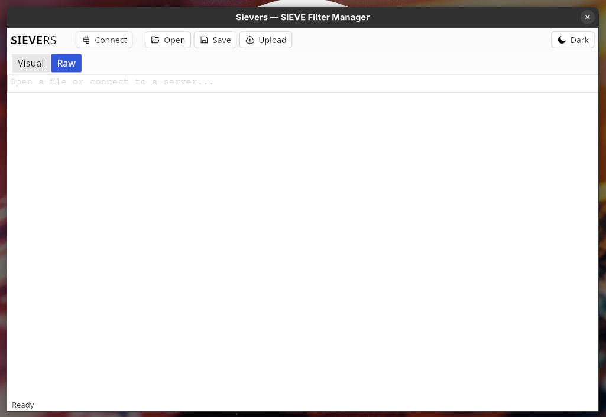
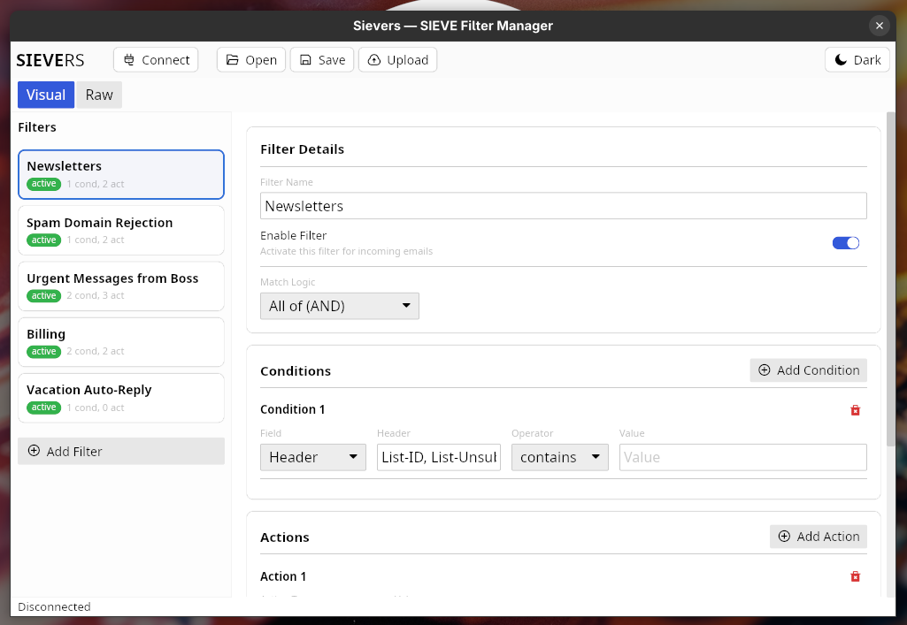
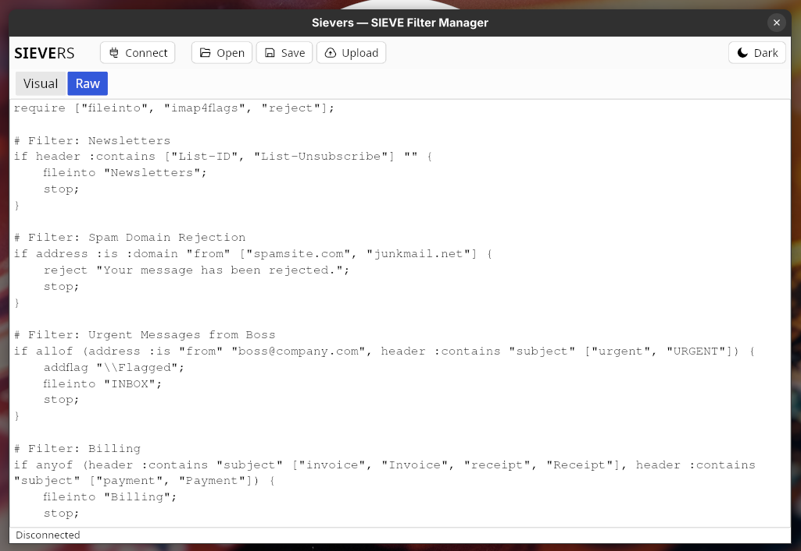
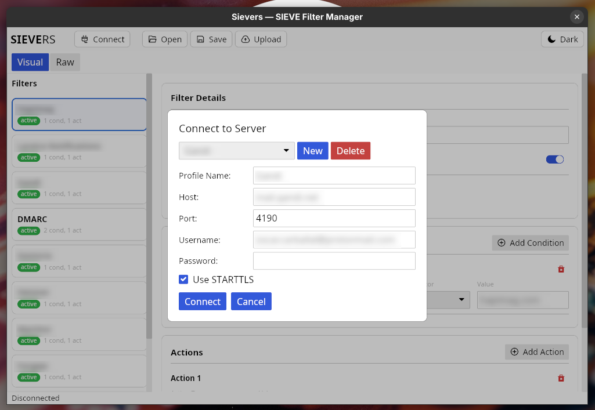

# Sievers

SIEVERS — Cross-platform SIEVE filter editor written in Rust

## Screenshots









## Building

### Prerequisites

- [Rust toolchain](https://rustup.rs/) (stable)
- For cross-compilation: [cross](https://github.com/cross-rs/cross) + Docker/Podman

### Linux (native)

Install system dependencies:

```bash
# Arch
sudo pacman -S pkg-config fontconfig freetype2 libxkbcommon wayland vulkan-icd-loader

# Ubuntu/Debian
sudo apt install pkg-config libfontconfig1-dev libfreetype6-dev libxkbcommon-dev libwayland-dev libvulkan-dev
```

Build:

```bash
cargo build --release
```

Binary output: `target/release/sievers`

### Windows (cross-compile from Linux)

Requires `cross` and Docker/Podman:

```bash
cargo install cross --git https://github.com/cross-rs/cross
cross build --release --target x86_64-pc-windows-gnu
```

Binary output: `target/x86_64-pc-windows-gnu/release/sievers.exe`

> **Note:** For a polished Windows release (proper icon, no console flash), building natively on Windows with the MSVC toolchain (`x86_64-pc-windows-msvc`) is recommended.

### macOS

Cross-compiling to macOS from Linux is unreliable due to Apple SDK licensing and Metal framework dependencies. Building natively on a Mac (or via macOS CI runners) is recommended:

```bash
# Add targets
rustup target add x86_64-apple-darwin aarch64-apple-darwin

# Apple Silicon
cargo build --release --target aarch64-apple-darwin

# Intel
cargo build --release --target x86_64-apple-darwin

# Universal binary (optional)
lipo -create \
  target/x86_64-apple-darwin/release/sievers \
  target/aarch64-apple-darwin/release/sievers \
  -output sievers-universal
```

### Release profile

The `Cargo.toml` release profile is pre-configured with:

| Setting | Value | Effect |
|---------|-------|--------|
| `strip` | `true` | Strips debug symbols |
| `lto` | `true` | Full link-time optimization |
| `opt-level` | `"s"` | Optimize for binary size |
